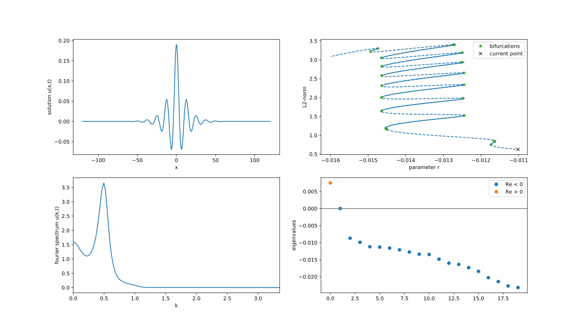

# BICE

[](https://gitlab.example.com/simon123h/bice/-/pipelines)
[](https://github.com/simon123h/bice/actions/workflows/ci.yml)


A numerical path continuation software written in Python.

## Example

Example of a bifurcation diagram with snaking in the Swift-Hohenberg equation obtained with _bice_, see the [corresponding SHE demo](src/bice/demos/notebooks/she.ipynb).


## Installation

To install the latest published version from PyPI simply execute:

```bash
pip3 install bice
```

If you instead want to install the package locally, e.g. for development purposes, you may download the latest version from this git and install it using:

```bash
git clone https://gitlab.com/simon123h/bice
pip3 install -e bice/
```

in any directory of your choice.

### Development Setup

To set up a local development environment with all dependencies, it is recommended to use a virtual environment:

#### Linux / macOS

```bash
# Create a virtual environment
python3 -m venv venv

# Activate the virtual environment
source venv/bin/activate

# Install the package in editable mode with development dependencies
pip install -e ".[dev]"
```

#### Windows

```powershell
# Create a virtual environment
python -m venv venv

# Activate the virtual environment
.\venv\Scripts\Activate.ps1

# Install the package in editable mode with development dependencies
pip install -e ".[dev]"
```

### Requirements

The software depends on Python 3 and the following third-party packages:
`numpy`, `scipy`, `matplotlib`, `findiff`, and `numdifftools`.
All will be installed automatically when installing `bice`.

## Tutorials

We have first tutorials!

- [Heat equation tutorial](src/bice/demos/notebooks/heat_eq.ipynb): a simple tutorial on how to use bice to implement a first partial differential equation and perform a time simulation of it.
- [Swift-Hohenberg equation tutorial](src/bice/demos/notebooks/she.ipynb): a simple tutorial on how to use bice's path continuation capabilities.
- [Predator-prey model tutorial](src/bice/demos/notebooks/lve.ipynb): an introduction into the continuation of periodic orbits.

More will follow soon.

Meanwhile you can check out the less documented [demos](src/bice/demos/).

## Documentation

Click here for the
[online version of the documentation](https://simon123h.gitlab.io/bice).

### Building the documentation locally

The documentation can be generated locally with:

```bash
# Using nox (recommended)
nox -s docs

# Or using make (Unix-like systems only)
cd docs
make html
```

The documentation can then be found in the folder `docs`.

You will need to have the development dependencies installed:

```bash
pip3 install -e ".[dev]"
```

### Running Checks

To ensure code quality, you can run the following commands locally:

```bash
# Using nox (recommended, handles its own environments)
nox -s lint
nox -s type_check
nox -s test

# Or manually in your active environment:
# Linting and formatting
ruff check .
ruff format .

# Type checking
mypy src/bice

# Tests
pytest tests/
```

For more details, see [CONTRIBUTING.md](CONTRIBUTING.md).
